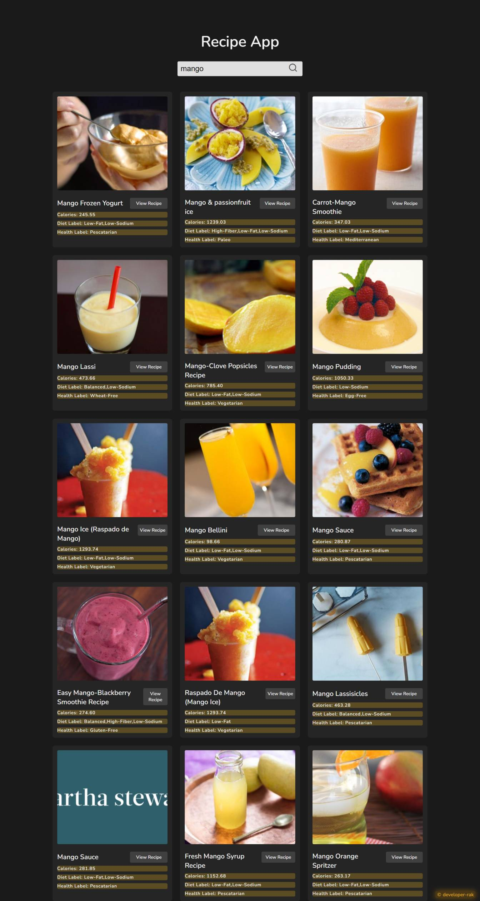

# :closed_book: Food Recipe app

### _recipe app using javascript !!_

### Link :link: 

## Interface

## Run Locally

  - Run This command `https://github.com/developer-rak/Food-Recipe-App.git`
  - You are now in the dev environment and you can play around

## ✨ Features

  - by search take your all fav recipe
  - Open Source (Tweak it and use it)

## ⚙️ Tech Stack
  - HTML5
  - CSS3
  - JavaScript
  - Netlify
